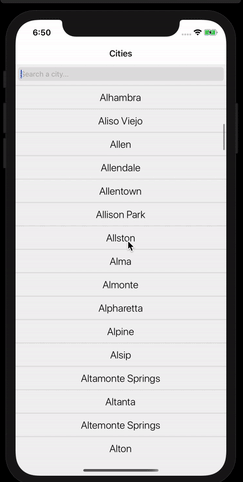

 
    

<h1 align="center">Index of React Native Projects</h1>

<table>
    <thead>
        <tr>
            <td>Project Name</td>
            <td>Repo Link</td>
            <td>App Link</td>
            <td>Overview</td>
        </tr>
    </thead>
    <tbody> 
    <tr>
            <td>Restaurant_Map_App</td>
            <td><a href="https://github.com/Meltem-Karaagac/Restaurant_Map_App_ReactNative" target="_blank">Repo details</a></td>
            <td></a></td>
            <td></td> 
        </tr>
    <tr>
            <td>Images_App </td>
            <td><a href="https://github.com/Meltem-Karaagac/Images_gallery_ReactNative" target="_blank">Repo details</a></td>
            <td></td>
            <td></td> 
        </tr><tr>
            <td>Shopping_App</td>
            <td><a href="https://github.com/Meltem-Karaagac/Shopping_project_ReactNative" target="_blank"> Repo details</a></td>
            <td></td>
            <td></td> 
        </tr>
        <tr>
            <td>Restaurant_App</td>
            <td><a href="https://github.com/Meltem-Karaagac/Restaurant_page_ReactNative" target="_blank">Repo details</a></td>
            <td></a></td>
            <td></td> 
        </tr>
         <tr>
            <td>News_App</td>
            <td><a href="https://github.com/Meltem-Karaagac/News_page_ReactNative" target="_blank">Repo details</a></td>
            <td></a></td>
            <td></td> 
        </tr>
        <tr>
            <td>Social_page_App</td>
            <td><a href="https://github.com/Meltem-Karaagac/Social_page_ReactNative" target="_blank">Repo details</a></td>
            <td></a></td>
            <td></td> 
        </tr>
        <tr>
            <td>Shopping_cart_App</td>
            <td><a href="https://github.com/Meltem-Karaagac/Shopping_cart_ReactNative" target="_blank">Repo details</a></td>
            <td></a></td>
            <td></td> 
        </tr>
        <tr>
            <td>Todo_App</td>
            <td><a href="https://github.com/Meltem-Karaagac/My_todolist_ReactNative" target="_blank"> Repo details</a></td>
            <td></td>
            <td></td> 
        </tr>
        </td> 
        </tr>
    </tbody>
</table>

  

