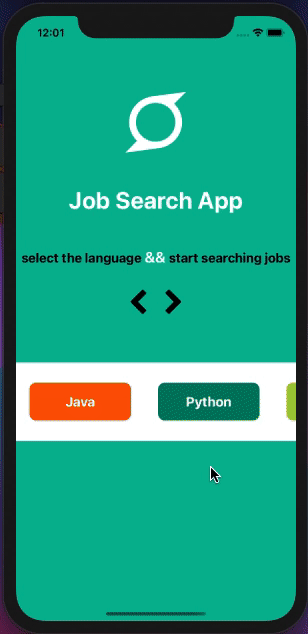
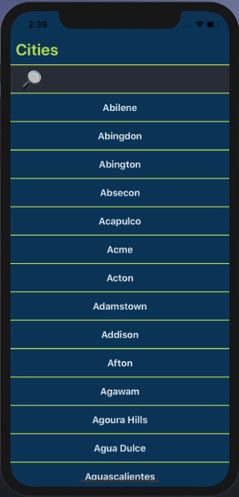
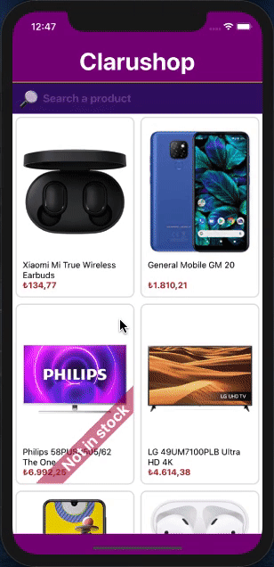

 
    
    <h1 align="center">Index of React Native Projects</h1>

 
 
  
  |Proje Name     | Repo link                                                      |  
 Overview
    |
  |--------------|:--------:|:--------------------------------------------------------------:|------------------------------------:|
      |Google Maps App (Coming soon...)| [Repository](https://github.com/SemihDurmus/RNSD_05_Google_Maps)||
  |Live Chat App  (with Firebase)| [Repository](https://github.com/SemihDurmus/RN_06_Live_Chat_Firebase)||
  |Job Search App| [Repository](https://github.com/SemihDurmus/RN_04_Job_Search_App)||
  |Restaurant App| [Repository](https://github.com/SemihDurmus/SDRN_03_Restaurant_App.git)||
  |Double Click to Like| [Repository](https://github.com/SemihDurmus/SDRN_02_Double_Click_to_Like.git)||
  |ToDo App | [Repository](https://github.com/SemihDurmus/RN_03_ToDo_App.git)||
  |Product Filtering | [Repository](https://github.com/SemihDurmus/SDRN_01_Product_Filtering.git)||
  
  

